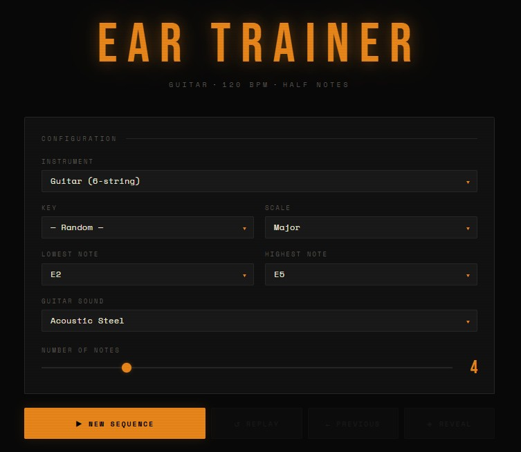

# Ear Trainer

A browser-based ear training tool for guitar and bass players. No installation required — open the HTML file in any modern browser and start playing.




---

## What It Does

The app plays a random sequence of notes and asks you to identify them by ear before revealing the answer as a guitar or bass tab. The workflow is simple:

1. Configure your session (instrument, key, scale, range, number of notes)
2. Click **New Sequence** — the notes play one by one
3. Replay as many times as you need
4. Click **Reveal** to see the tab when you're ready

---

## Features

- **Guitar and bass support** — 6-string guitar and 4-string bass, both in standard tuning across a full 24-fret range
- **Key selection** — choose a specific key or let the app pick one at random
- **Scale modes** — Major, Natural Minor, Pentatonic Major, Pentatonic Minor, Blues, Chromatic
- **Adjustable note range** — set the lowest and highest note; range options are constrained to what's physically playable on the selected instrument
- **Note count** — 2 to 12 notes per sequence
- **Multiple sounds** — three guitar tones (Acoustic Steel, Electric Clean, Electric Overdriven) and two bass tones (Finger Style, Pick Style), all using real sampled instruments
- **Tab reveal** — notes are shown as ASCII guitar/bass tab using a lowest-fret position strategy
- **Previous sequence** — accidentally hit New Sequence? Go back to the last one
- **Replay** — listen again as many times as you need before revealing

---

## Usage

### Option 1 — Open locally
Download `ear-trainer.html` and open it directly in your browser. No server needed.

> **Note:** an internet connection is required. The app loads the Tone.js audio library and instrument samples from a CDN at runtime.

### Option 2 — Host it
Drop `ear-trainer.html` on any static hosting service (GitHub Pages, Netlify, Vercel, etc.) and share the URL. No build step, no dependencies to install.

---

## Browser Compatibility

| Browser | Status |
|---------|--------|
| Chrome | ✅ Full support |
| Firefox | ✅ Full support |
| Safari | ✅ Supported (see note below) |
| Edge | ✅ Full support |

**Safari note:** Safari has a strict autoplay policy for Web Audio. The app handles this correctly — audio is only ever triggered by a direct button click, so it works fine. However, if you are using Safari on macOS, the audio output will use whichever device is set as the system default *at the time the page loads*. If you want audio through a Bluetooth speaker, set it as your default output device in System Settings → Sound before opening the app.

---

## Tempo and Timing

Notes are played at **120 BPM** as **half notes** — one note every second. This is intentional: it gives you enough time to mentally process each pitch without the sequence feeling sluggish. There is no metronome pulse, so your ear is focused purely on pitch rather than rhythm.

---

## Tab Display

Tabs are rendered using a **lowest-fret strategy**: each note is placed on whichever string requires the fewest frets from the nut. This biases toward open and first-position playing, which is the most beginner-friendly representation and the most common default in printed tab.

Each column is one note played in sequence, left to right.

**Guitar example** — 4 notes, G Major:

```
e |---|---|---|---|
B |---|---|---|---|
G |---|---|---|-0-|
D |---|---|-0-|---|
A |---|-2-|---|---|
E |-3-|---|---|---|
```

**Bass example** — 4 notes, E Minor Pentatonic:

```
G |---|---|---|---|
D |---|---|---|-0-|
A |---|---|-0-|---|
E |-0-|-3-|---|---|
```

---

## Technical Notes

- Built with vanilla HTML, CSS, and JavaScript — no framework, no build toolchain
- Audio engine: [Tone.js](https://tonejs.github.io/) (v14)
- Instrument samples: [midi-js-soundfonts](https://github.com/gleitz/midi-js-soundfonts) (FluidR3 GM soundfont, MP3)
- All six instrument sounds are preloaded in the background when the page opens, staggered to avoid hammering the CDN
- If a sample fails to load, the app silently falls back to a synthesized tone so playback always works

---

## Problems

If you run into a bug or something behaves unexpectedly, feel free to open an issue. This project is not actively maintained, so there is no guarantee of a fix or response timeline, but reports are welcome.

---

## License

MIT License. Do whatever you want with it — use it, modify it, share it, include it in your own projects.
